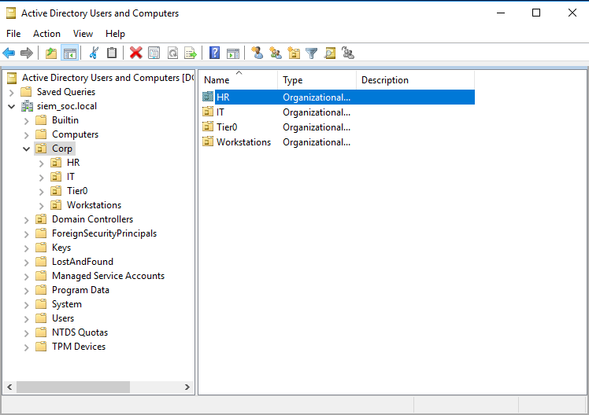
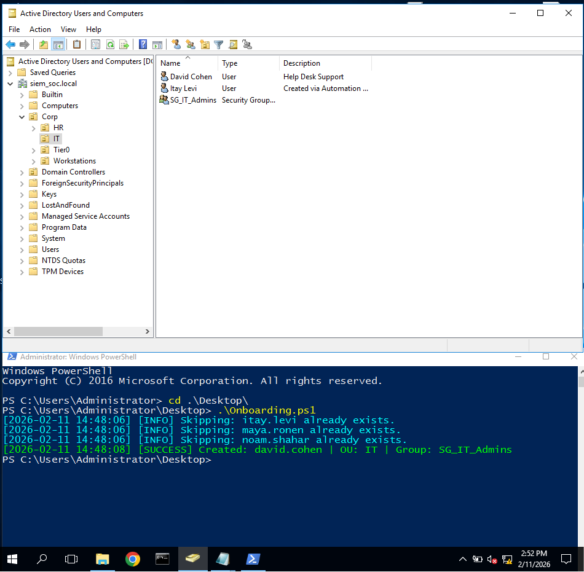
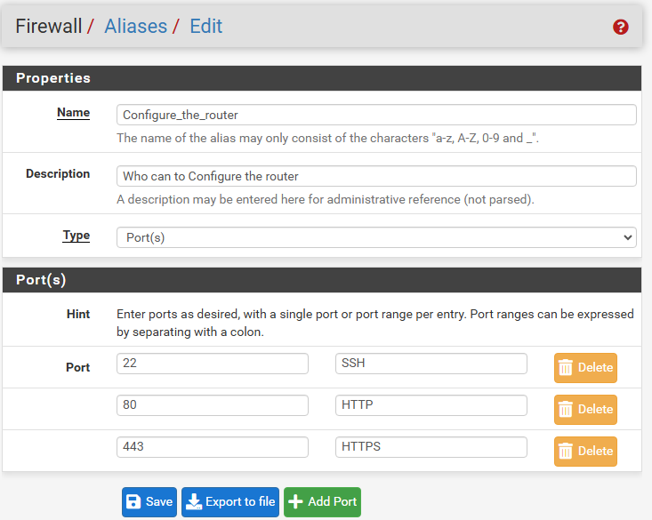

Phase-01-Network-Infrastructure/README.md 

# Enterprise Network Security SOC Lab
## Phase 01: Network Infrastructure & Security Architecture

### Overview
This phase focuses on building a highly secure, segmented network infrastructure designed to emulate a realistic enterprise environment. The primary objective is to implement strict access controls, proactive threat blocking, and identity management based on the Zero Trust model.

---

### 1. Network Topology and Segmentation

To ensure complete isolation between high-risk zones (Users) and critical assets (Servers), the network architecture departs from traditional flat topologies where threats can easily move laterally. 

I configured the Hypervisor with three separate network interfaces, forcing all inter-VLAN and outbound traffic to pass directly through the pfSense firewall for deep packet inspection and strict routing enforcement.

**Interface Configuration:**
* **WAN Interface (em0):** The external connection utilizing NAT for internet access (10.0.2.0 network).
* **Servers Zone (em2):** A strictly isolated network (192.168.10.0/24) hosting the Domain Controller and critical infrastructure.
* **Users Zone (em1):** A separate network (192.168.20.0/24) dedicated entirely to employee workstations.

---

### 2. Identity Management Strategy

A secure network requires a structured approach to identity. I deployed the Domain Controller using a hierarchical Active Directory structure to logically separate human users from administrative accounts and infrastructure objects. This allows for precise application of Group Policies (GPO) and Role-Based Access Control (RBAC).

**Organizational Unit (OU) Structure:**
* **Tier0:** Reserved exclusively for Domain Admins and critical infrastructure accounts.
* **IT:** Department designated for privileged users.
* **HR:** Department designated for standard users.
* **Workstations:** A dedicated container for computer objects, enforcing LAPS (Local Administrator Password Solution) policies.

---

### 3. Automation and Onboarding

Human error during user provisioning often leads to security vulnerabilities, such as over-privileged accounts or orphaned access. To mitigate this, I developed a PowerShell automation script for the onboarding process.

**Execution Logic:**
1. **Input:** The script parses a standardized CSV file provided by HR.
2. **Logic:** It automatically categorizes and moves users into their respective Organizational Units (IT or HR).
3. **Security:** It instantly assigns the correct Security Groups, ensuring the Principle of Least Privilege is enforced from the exact moment of account creation.

---

### 4. Firewall Management Plane Hardening

Protecting the control plane of security appliances is critical to prevent attackers from modifying routing or firewall rules. I secured the administrative interface to neutralize lateral movement attacks targeting infrastructure devices.

**Access Control Configuration:**
* **Allowed Source:** Only a specific designated Admin PC IP address is permitted to access the management portal.
* **Blocked Sources:** All other networks and IP ranges are explicitly blocked from accessing Management Ports (443, 80, and 22).

As demonstrated below, any attempt by a standard user from the `NET_USERS` network to access the router's configuration portal is actively dropped, resulting in a connection timeout.

---

### 5. Threat Intelligence and Dynamic Blocking

To shift from a reactive to a proactive defense posture, I implemented an automated mechanism within the firewall to block known malicious actors before they can interact with the network.

**Implementation Details:**
* **External Feeds:** The firewall aggregates real-time IP blacklists from threat intelligence sources such as Abuse.ch and Emerging Threats.
* **Automated Updates:** These lists dynamically synchronize every 24 hours, ensuring continuous protection against emerging botnets and malware infrastructure.
* **Kill Chain Prevention:** Any internal or external traffic attempting to communicate with these identified IPs is immediately dropped. This effectively neutralizes the Command and Control (C2) phase of the cyber kill chain.

---

### 6. Access Control: LAN to Domain Controller

To protect the Identity Infrastructure, I enforced a strict Positive Security Model (Default Deny). Instead of exposing the server to all internal traffic, I created a dedicated Port Alias that permits only the exact protocols necessary for Active Directory functions.

**The Problem:** In default networks, workstations can access sensitive server services such as Remote Desktop (RDP) or PowerShell Remoting (WinRM), opening vectors for exploitation.
**The Solution:** All traffic is blocked by default. Only required authentication and directory services are explicitly whitelisted.

**Technical Implementation:**
* **Allowed Services:** DNS (53), Kerberos (88), LDAP (389), NTP (123), and specific RPC dynamic ranges.
* **Blocked Services:** Management protocols like RDP (3389) and WinRM (5985) are completely blocked from the User LAN.

---

### 7. Final LAN Rules Configuration

I consolidated all individual security policies into a structured, top-down ruleset on the LAN interface. Firewalls process rules sequentially, so the order is engineered to enforce Zero Trust while maintaining business continuity.

**Ruleset Execution Order:**
1. **Allow Active Directory:** Grants access to the Domain Controller strictly via the `AD_Required_Ports` alias.
2. **Block Malicious IPs:** Drops traffic destined for the Global Threat Feeds and C2 lists.
3. **Block Router Configuration:** Explicitly denies access to firewall management ports from unauthorized sources.
4. **Allow HTTPS:** Permits standard encrypted web traffic for regular daily operations. Everything else implicitly hits the default deny rule.

---

### 8. Perimeter Hardening (WAN Interface)

To protect the external-facing perimeter from IP spoofing and specialized reconnaissance attacks, I hardened the WAN interface against unauthorized network assignments.

**Configuration:**
* **Block Private Networks (RFC 1918):** Drops inbound internet traffic claiming to originate from internal IP addresses (e.g., 10.x.x.x, 192.168.x.x). Such traffic is technically impossible on the public internet and is a clear indicator of spoofing.
* **Block Bogon Networks:** Drops traffic from unassigned or reserved IP ranges that should never route over the public internet, frequently utilized in DDoS amplification attacks.

