### Phase 2: Active Directory Hardening & Identity Isolation
Design Objectives: Breaking the Attack Chain
This phase transitions the Active Directory environment from a flat, permissive state to a Zero-Trust Baseline. The primary objective is to disrupt the adversary's lifecycle—specifically Credential Harvesting and Lateral Movement—by enforcing strict trust boundaries and eliminating legacy attack vectors.

Strategic Enforcement Pillars:
Identity Tiering (LSASS Protection): Logical isolation of administrative tokens to prevent Tier 0 credential exposure on high-risk Tier 2 assets.

Protocol Eradication: Migration to a Kerberos-only environment by disabling NTLM, LLMNR, and NetBIOS, neutralizing Relay and Poisoning vectors.

Execution Control (AppLocker): Kernel-level binary verification using digital signatures to block Living off the Land (LotL) tactics.

Telemetry Augmentation: Transformation of endpoints into high-fidelity sensors via Script Block Logging and Process Command-Line Auditing.

Identity Segmentation: Tiered Administration
Objective: Mathematically eliminate the risk of Domain Admin credential theft from compromised workstations.

Engineering Logic:
The architecture enforces a "Boundary of Trust" by ensuring that high-privileged identities never authenticate to lower-security assets. This prevents the LSASS (Local Security Authority Subsystem Service) process from caching Tier 0 hashes/tickets on Tier 2 endpoints.

Tier 0 OU (Root of Trust): Dedicated container for Domain Controllers and administrative identities (e.g., Admin Nehorai).

URA Enforcement: Deployment of a "Deny-by-Default" User Rights Assignment GPO. This explicitly blocks Domain Admins from all logon vectors (Local, Network, RDP, Service, Batch) on workstations.

Result: An adversary achieving SYSTEM level access on a workstation will find zero high-privileged memory artifacts to harvest for Pass-the-Hash (PtH).

 
 

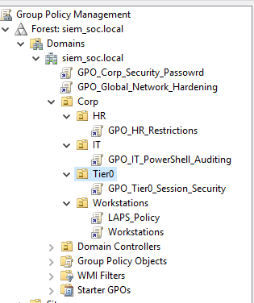
`Active Directory Users and Computers > siem_soc.local > Corp > [Departments]`

Organizational Unit (OU) & Policy Architecture
Objective: To establish a granular, hierarchical structure that facilitates the systematic enforcement of the Principle of Least Privilege (PoLP) across the enterprise.

Engineering Logic:
A secure Active Directory environment requires the logical separation of assets and identities to prevent "policy bleeding"—where generic security settings accidentally grant excessive permissions. I engineered a modular OU hierarchy within the Corp container, allowing for targeted Group Policy Object (GPO) application based on the functional risk profile of each entity.

Global Security Baseline: GPOs linked at the domain root (e.g., Global_Network_Hardening) establish universal security controls for all objects, ensuring a consistent minimum security posture across the entire forest.

Departmental Hardening (HR/IT): Policies are applied at the sub-OU level to match specific user roles. The HR OU is subject to maximum Attack Surface Reduction (ASR) via execution restrictions, while the IT OU is configured for high-fidelity forensic auditing to monitor administrative activity.

Tiered Isolation (Tier0/Workstations): This structure serves as the technical foundation for the Tiered Administration Model. By segregating Tier 0 assets from workstation endpoints into dedicated OUs, we can apply mutually exclusive policies—such as LAPS for workstations and Session Security for domain controllers—to prevent credential leakage between security zones.

---

###  Basic Hardening and Attack Surface Reduction

Host-Level Hardening: UI-Layer Attack Surface Reduction (ASR)
Objective: To neutralize local reconnaissance capabilities for non-privileged users by restricting access to native system management interfaces.

Engineering Logic:
The HR department represents a significant risk surface due to the high volume of external communications. In a default environment, a compromised standard account provides an immediate platform for an adversary to perform Enumeration (e.g., whoami, net user, ipconfig). By enforcing a Deny-by-Default UI policy, we strip the adversary of these native tools, forcing them to import external binaries which are more likely to be intercepted by EDR/SIEM telemetry.

Key Security Controls:

Administrative Interface Isolation: Prohibited access to the Control Panel and PC Settings to prevent unauthorized modifications of local security configurations and network settings.

Shell Restriction (CMD/PowerShell UI): Disabled the Command Prompt and PowerShell interfaces for the HR OU. This prevents the execution of manual discovery commands and simple batch-based automation during the initial foothold phase.

Registry Integrity Protection: Explicitly disabled Regedit.exe to block unauthorized modifications to User-level registry hives (HKCU), a primary target for establishing Persistence via Run keys.

Configuration Path (GPO):
User Configuration > Policies > Administrative Templates > System
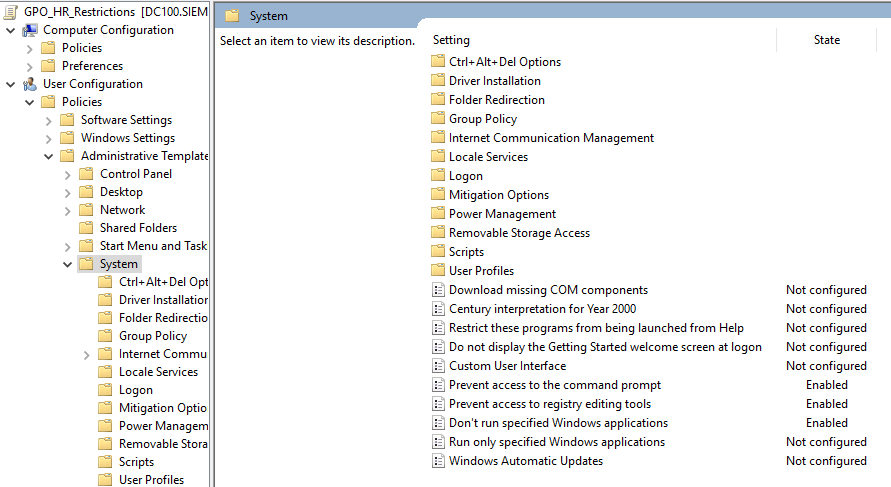

 
 

### Kernel-Level Execution Control: Microsoft AppLocker
Objective: To implement a robust, bypass-resistant application control framework that ensures only authorized, cryptographically verified binaries can execute.

Engineering Logic:
While UI-based restrictions (GPOs) provide a necessary first layer of defense, they are easily bypassed by renaming executables or invoking them via background processes. To achieve true Attack Surface Reduction (ASR), I deployed Microsoft AppLocker. Unlike legacy "Software Restriction Policies," AppLocker operates at the OS kernel level, inspecting every execution request against a set of predefined rules before the process is allowed to initialize.

Implementation Phases:
A. Service Automation (The Enforcement Engine)
AppLocker relies on the Application Identity Service (AppIDSvc) to retrieve file metadata and verify signatures. By default, this service is not active. I engineered a GPO to force the service to Automatic start-up across the domain. This ensures that the enforcement engine is initialized during the boot sequence, leaving no window for unauthorized execution before policy application.

Publisher-Based Rule Logic (Identity vs. Path)
I discarded weak, legacy "Path" and "Hash" rules which are trivial to bypass (via renaming or file updates). Instead, I implemented Publisher Conditions.

Mechanism: This logic inspects the Digital Certificate embedded in the binary.

The "Deny" Logic: I created explicit Deny rules for the HR group targeting CMD.EXE, POWERSHELL.EXE, and REGEDT32.EXE. Because these rules target the Publisher (Microsoft Windows), even if an attacker renames CMD.EXE to CALC.EXE, the kernel will identify the cryptographic signature and block execution.

Operational Verification
The effectiveness of the kernel-level policy is demonstrated through a live execution test on a production endpoint. Any attempt to invoke a restricted binary—whether through the UI, a script, or a secondary process—is intercepted by the AppLocker driver, resulting in a system-level termination of the execution request.
 
 
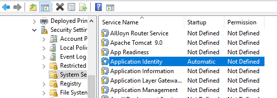
 
Computer Configuration \ Policies \ Windows Settings \ Security Settings \ System Services \ Application Identity
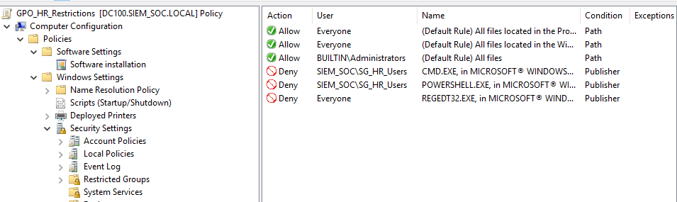
 
Computer Configuration \ Policies \ Windows Settings \ Security Settings \ Application Control Policies \ AppLocker \ Executable Rules
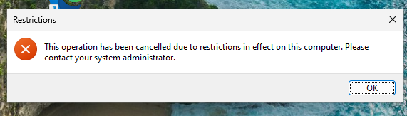

 
 

---

## Forensic Telemetry & Execution Visibility

**Objective:** To transform endpoints into high-fidelity sensors, eliminating visibility "blind spots" within the SIEM by capturing detailed execution artifacts and neutralizing script-based obfuscation at the source.

### Process Creation Auditing (Event ID 4688)

**The Logic:** Default Windows configurations do not log process initialization, allowing adversaries to run discovery tools or malicious binaries without leaving a forensic footprint. I enabled **Audit Process Creation** to generate **Event ID 4688** for every executable launch, providing the baseline audit trail needed to reconstruct an attacker’s timeline.

**Path:** `Computer Configuration > Policies > Windows Settings > Security Settings > Advanced Audit Policy Configuration > Audit Policies > Detailed Tracking > Audit Process Creation`

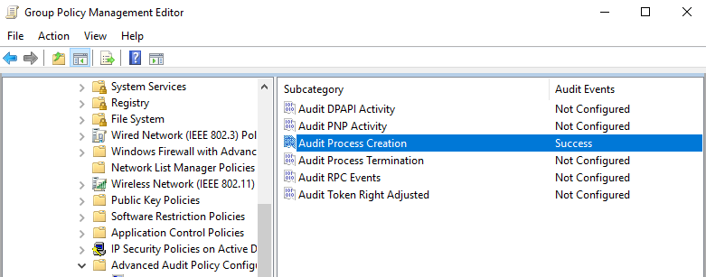

### Data Enrichment: Command-Line Argument Capture

**The Logic:** A process name alone (e.g., `powershell.exe`) is insufficient for triage. To identify **Malicious Intent**, the SOC must see the specific arguments passed to the process. This setting forces the kernel to log the full command string, which is critical for detecting encoded payloads, hidden windows, and unauthorized network connections.

**Path:** `Computer Configuration > Policies > Administrative Templates > System > Audit Process Creation > Include command line in process creation events`

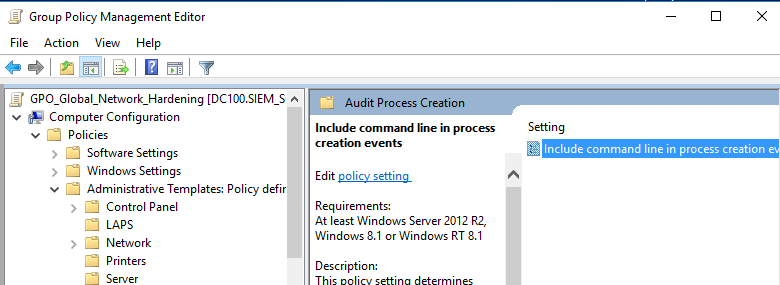

### Neutralizing Obfuscation: PowerShell Script Block Logging

**The Logic:** Adversaries use encoding (Base64) and string manipulation to bypass signature-based defenses. **Script Block Logging** intercepts the code at the engine level after it has been de-obfuscated in memory—immediately before execution—and logs the **Plain Text** script. This is the primary defense against **Fileless Attacks** and **Living off the Land (LotL)** techniques.

**Path:** `Computer Configuration > Policies > Administrative Templates > Windows Components > Windows PowerShell > Turn on PowerShell Script Block Logging`

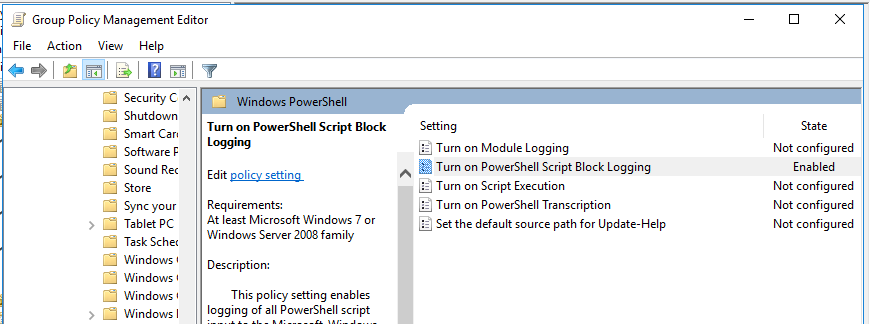

---

### Strategic SOC Impact:

* **Real-Time De-obfuscation:** Capturing script blocks in plain text eliminates the need for manual decoding during an incident, directly reducing **MTTR** (Mean Time to Respond).
* **High-Fidelity Context:** Command-line auditing transforms generic process logs into actionable forensic data, revealing specific attacker TTPs.
* **Tamper Resistance:** Utilizing native kernel-level controls ensures consistent telemetry that is significantly harder for an adversary to suppress compared to third-party agents.

 
 

### Technical Analysis:

* **Parent-Child Relationship (Event 4688):** This event captures the **New Process ID** and the **Creator Process ID**. This allows the SOC to build a "Process Tree," revealing the execution chain—for example, identifying if a web browser (`chrome.exe`) spawned a command shell (`cmd.exe`), which is a major red flag for an exploit.
* **Buffer Logging (Event 4104):** Unlike standard logging, Script Block Logging (ID 4104) captures the entire buffer processed by `System.Management.Automation.dll`. Since the engine must de-obfuscate the code to run it, the log captures the final, "clean" version of the script regardless of how it was encoded on the disk or in the initial command.
* **Registry-Level Enforcement:** Enabling command-line auditing modifies the `ProcessCreationIncludeCmdLine_Enabled` value in the registry. This instructs the Windows auditing engine to copy the process parameters into the security event log buffer during the `NtCreateUserProcess` syscall.
---

## Identity Segmentation & Lateral Movement Eradication

**Objective:** To eliminate the risk of privilege escalation and lateral movement by implementing a strict Tiered Administration Model, ensuring that high-privileged credentials are never exposed on lower-security assets.

### Tiered Administration Architecture

**The Logic:** In a default Active Directory environment, administrative accounts are often used across all workstations, leading to "identity sprawl." I engineered a logical separation of assets and identities by creating a dedicated **Tier 0 OU**. This container acts as a "security vault" for the domain's most sensitive identities (e.g., `Admin Nehorai`), isolating them from the standard user population and workstations.

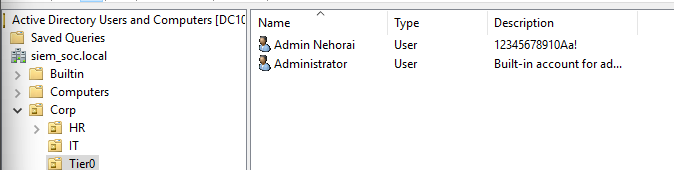

### Administrative Boundary Enforcement (URA)

**The Logic:** To enforce the boundary between security tiers, I deployed a **User Rights Assignment (URA)** GPO. This policy implements a "Deny-by-Default" rule that explicitly blocks the **Domain Admins** group from authenticating on any Tier 2 Workstation. By denying access across all primary logon vectors—Local, Network, RDP, Service, and Batch—the identity perimeter is mathematically secured against unauthorized access.

**Path:** `Computer Configuration > Policies > Windows Settings > Security Settings > Local Policies > User Rights Assignment`

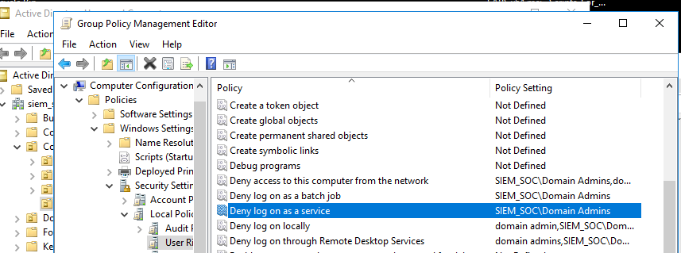
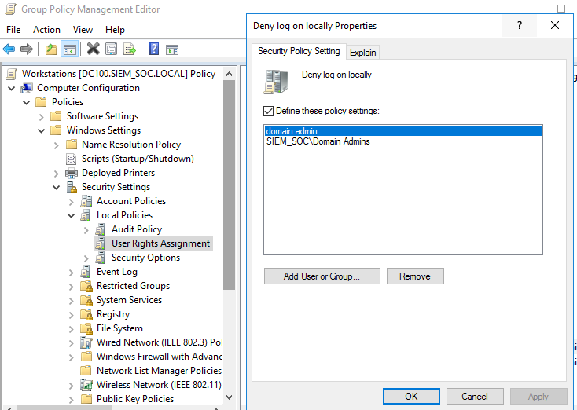

---

### Technical Analysis:

* **LSASS & Credential Harvesting Mitigation:** When a user authenticates to a Windows machine, credential material (NTLM hashes or Kerberos tickets) is cached in the **LSASS (Local Security Authority Subsystem Service)** memory process. If an adversary compromises a workstation, they can dump LSASS to harvest these credentials. By blocking Tier 0 logons to workstations, we ensure that high-privileged hashes never exist in the memory of a Tier 2 asset, effectively neutralizing **Pass-the-Hash (PtH)** attacks.
* **Eradicating Lateral Movement:** The most common attack path involves compromising a standard user and "pivoting" through the network to find a machine where an administrator is logged in. This tiered architecture breaks this chain; even if an attacker achieves `SYSTEM` privileges on every workstation in the domain, they are structurally prevented from capturing a Tier 0 token.
* **URA Priority:** Within the Windows security subsystem, a **Deny** right in the User Rights Assignment always takes precedence over an **Allow** right. This ensures that even if an administrator is accidentally added to a local "Remote Desktop Users" group, the GPO-level Deny will maintain the security boundary and block the session.

 
 
---
## Endpoint Identity Hardening & LAPS Implementation

**Objective:** To eliminate the risk of domain-wide lateral movement by ensuring that a compromise of a single local administrator account does not grant access to any other endpoint in the network.

### Local Administrator Password Solution (LAPS)

**The Logic:** In a typical enterprise environment, the local "Administrator" account often shares the same static password across all workstations. This creates a critical vulnerability: if an adversary compromises one machine and extracts the local admin hash, they can use **Pass-the-Hash (PtH)** to pivot across the entire domain. I implemented Microsoft LAPS to automate and secure the local identity lifecycle.

**Operational Impact:**
* **Password Uniqueness:** LAPS forces every workstation to generate a unique, highly complex, and randomized password for its local administrator account. This effectively destroys the "Golden Password" attack vector.
* **Encrypted Centralization:** Passwords are no longer stored on the local disk. Instead, they are encrypted and stored within the **ms-Mcs-AdmPwd** attribute of the computer object in Active Directory, accessible only by authorized IT personnel.

**Path:** `Computer Configuration > Policies > Administrative Templates > LAPS`

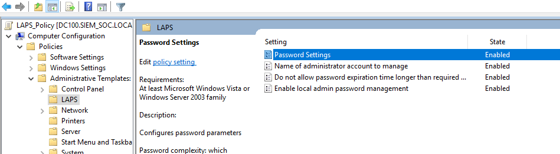
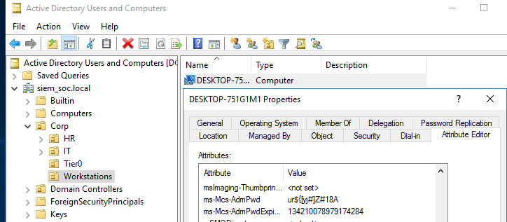

### Built-in Administrator Obfuscation (Rename)

**The Logic:** The built-in Administrator account (SID-500) is a static target for automated brute-force scripts. I implemented a GPO to rename this account to **emergencyIT**. This provides a layer of **Security through Obfuscation**, causing automated credential-stuffing tools to fail immediately at the username validation phase, reducing the attack surface and filtering out low-level "noise" in the security logs.

**Path:** `Computer Configuration > Policies > Windows Settings > Security Settings > Local Policies > Security Options > Accounts: Rename administrator account`

---

### Technical Breakdown:

* **Breaking the SAM Database Value:** In a standard environment, the NTLM hash of the local administrator is identical across the fleet. LAPS ensures that the SAM (Security Account Manager) database of every endpoint contains a unique secret, mathematically preventing lateral movement via local credential reuse.
* **Role-Based Access (RBAC):** Access to the passwords stored in Active Directory is governed by ACLs on the `ms-Mcs-AdmPwd` attribute. This ensures that even if a Tier 2 support account is compromised, the attacker cannot read the local administrator passwords of other Tier 2 assets or Tier 0 servers.
* **SID-500 Consistency:** While the account is renamed for obfuscation, its Security Identifier (SID) remains unchanged (ending in -500). This allows the SOC to maintain consistent monitoring and alerting on this high-risk account regardless of its display name.
ה
---

## Protocol Sanitization: Eradicating Legacy SMBv1

**Objective:** To eliminate the enterprise attack surface associated with unauthenticated legacy protocols and mitigate the risk of remote code execution (RCE) and lateral ransomware propagation.

### The Engineering Logic: Why Eradicate SMBv1?

SMBv1 is a 30-year-old legacy protocol that is fundamentally insecure. It lacks modern security features such as pre-authentication integrity, encryption, and robust message signing. Most importantly, it is the primary vector for the **EternalBlue (MS17-010)** exploit, which facilitated global ransomware outbreaks like WannaCry and NotPetya. By systematically removing this protocol, we achieve a higher state of **Infrastructure Hardening**.

---

### Implementation Phases:

#### I. Server-Side Disablement (Registry Hardening)

To prevent the system from accepting SMBv1 inbound connections (acting as a server), I implemented a Registry-level restriction. By setting the **SMB1** parameter to **0**, the LanmanServer service is instructed to reject any negotiation requests utilizing the version 1.0 dialect.

* **Registry Path:** `HKLM\SYSTEM\CurrentControlSet\Services\LanmanServer\Parameters`
* **Value:** `SMB1` (REG_DWORD) = `0`

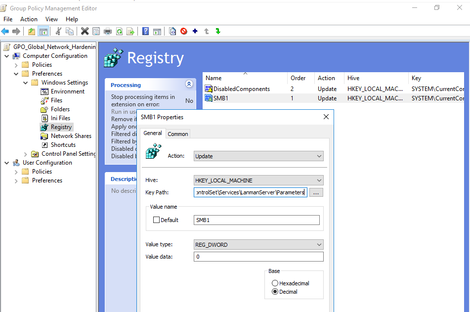

#### II. Kernel-Level Driver Deactivation (mrxsmb10)

Disabling the registry key only stops the server component. To ensure the OS cannot act as an SMBv1 client, the underlying Kernel driver must be neutralized. I reconfigured the **mrxsmb10** (SMB 1.0 Mini-Redirector) driver to a disabled state. Setting the start value to **4** prevents the driver from initializing during the boot sequence, effectively removing the protocol from the Windows network stack.

* **Registry Path:** `HKLM\SYSTEM\CurrentControlSet\Services\mrxsmb10`
* **Value:** `Start` (REG_DWORD) = `4`

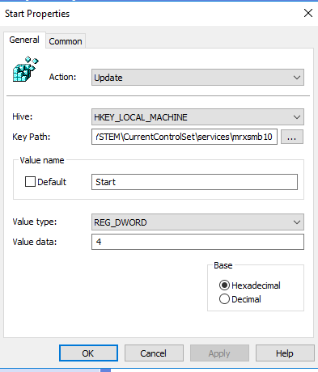

#### III. Post-Enforcement Verification & Auditing

To ensure the integrity of the hardening process, I performed a forensic audit of the service states. Using system-level queries, I verified that the SMBv1 components are no longer active in the runtime environment. This confirms that the environment has successfully migrated to a minimum of SMBv2.1/v3.0, which supports advanced security features like AES-CCM encryption.

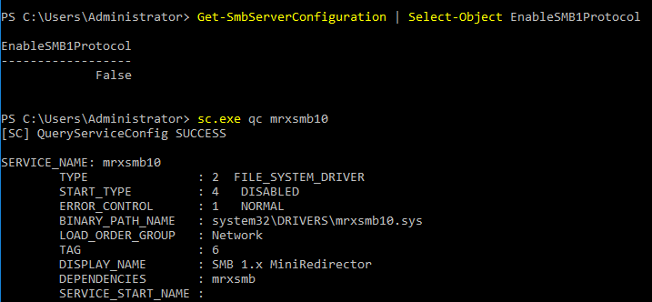

---

### High-Resolution Technical Breakdown:

* **The mrxsmb10 Driver:** This is a kernel-mode driver that functions as a network redirector. It resides between the User Mode application and the network hardware. By disabling it, any application attempting to initiate an SMBv1 connection will fail at the system call level, as the operating system no longer possesses the instructions required to "speak" the protocol.
* **MS17-010 (EternalBlue) Mitigation:** The EternalBlue exploit targets a buffer overflow vulnerability within the way SMBv1 handles specially crafted packets. By deactivating the protocol at the registry and driver levels, the vulnerable code is never loaded into memory, making the system mathematically immune to this specific exploit chain regardless of patch status.
* **Protocol Negotiation:** In a hardened state, the client and server will only negotiate via SMBv2 or higher. This enables **SMB Signing**, which protects against Man-in-the-Middle (MitM) attacks by ensuring the integrity of every packet via a cryptographic hash.
---

### 8. NTLM Eradication & Kerberos Enforcement

[cite_start]**The Reason:** NTLM is a legacy authentication protocol that lacks mutual authentication[cite: 121]. [cite_start]This fundamental flaw allows attackers to easily intercept and relay credentials (NTLM Relay Attacks) to gain unauthorized access[cite: 121].

[cite_start]**The Explanation:** I secured the identity perimeter by completely disabling NTLM, forcing the environment to exclusively use Kerberos, which cryptographically verifies both client and server identities[cite: 122]. [cite_start]By setting the "Restrict NTLM: Incoming NTLM traffic" policy to "Deny all accounts", workstations are structurally hardened to reject legacy authentication attempts, effectively neutralizing Pass-the-Hash and inbound NTLM Relay attacks domain-wide[cite: 124, 126].

**Configuration Path:**
[cite_start]`Computer Configuration > Policies > Windows Settings > Security Settings > Local Policies > Security Options > Network security: Restrict NTLM: Incoming NTLM traffic` [cite: 124]

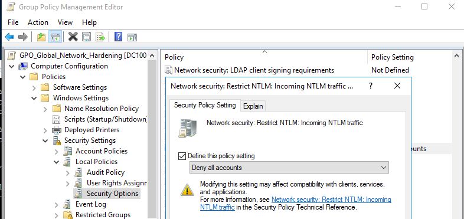
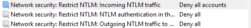

---

### 9. Network Cryptography: Bidirectional SMB Signing

[cite_start]**The Reason:** By default, Windows network communications do not require cryptographic signatures[cite: 129]. [cite_start]Adversaries exploit this to silently intercept traffic between workstations and servers, altering packets or relaying authentication handshakes (Man-in-the-Middle)[cite: 130].

[cite_start]**The Explanation:** I explicitly mandated digital signatures for both the originating traffic (Microsoft network client) and the receiving traffic (Microsoft network server)[cite: 131]. [cite_start]This establishes a two-way cryptographic trust requirement[cite: 132]. [cite_start]Every single packet must now carry a valid signature generated from the authenticated session key[cite: 133]. [cite_start]If an attacker attempts a relay attack, the connection drops immediately because they lack the cryptographic session key to sign manipulated packets[cite: 134].

**Configuration Path:**
[cite_start]`Computer Configuration > Policies > Windows Settings > Security Settings > Local Policies > Security Options > Microsoft network client/server: Digitally sign communications (always) > Enabled` [cite: 135]

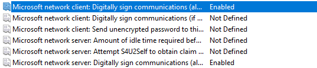

---

### 10. Defeating Network Poisoning: LLMNR & NBT-NS

[cite_start]**The Reason:** When primary DNS resolution fails, Windows endpoints default to broadcast protocols like Link-Local Multicast Name Resolution (LLMNR) and NetBIOS Name Service (NBT-NS)[cite: 138]. [cite_start]Attackers exploit this via tools like Responder, listening for these broadcasts, spoofing the requested resource, and capturing the victim's NTLM hash when the machine attempts to authenticate[cite: 139, 140].

[cite_start]**The Explanation:** I implemented a two-pronged architectural defense to enforce strict DNS-only name resolution[cite: 141]. [cite_start]I eradicated LLMNR by deploying a GPO that explicitly turns off multicast name resolution at the system level[cite: 143]. [cite_start]Concurrently, I neutralized NBT-NS by deploying a PowerShell startup script that forcefully changes the `NetbiosOptions` registry key, unbinding the legacy broadcast protocol directly from the workstation's network interface card[cite: 146, 149]. [cite_start]Audits verified both protocols are permanently disabled[cite: 147, 148].

**Configuration Paths:**
* [cite_start]**Disable LLMNR:** `Computer Configuration > Policies > Administrative Templates > Network > DNS Client > Turn off multicast name resolution > Enabled` [cite: 144]
* [cite_start]**Disable NetBIOS (Startup Script):** `Set-ItemProperty -Path "HKLM:\SYSTEM\CurrentControlSet\Services\NetBT\Parameters\Interfaces\tcpip*" -Name NetbiosOptions -Value 2` [cite: 146]

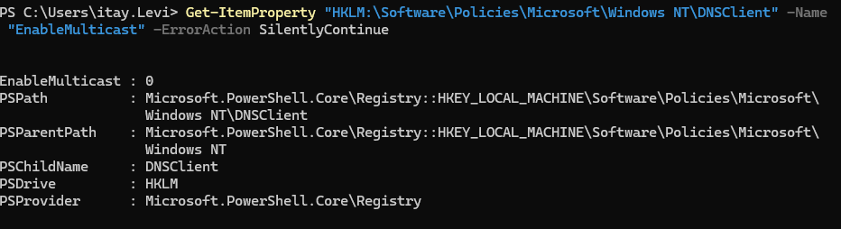
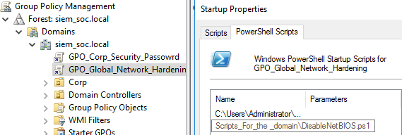

