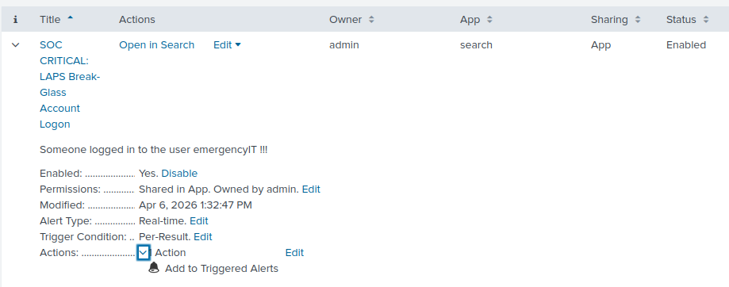
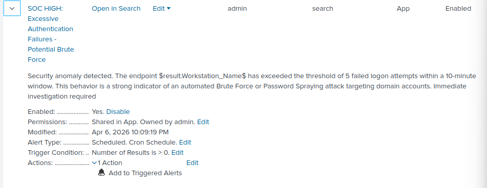

Phase-03-Detection-Engineering/README.md
# Phase 3: Detection Engineering and SIEM Architecture

## 1. Executive Summary
This phase establishes the foundational infrastructure for log aggregation by facilitating the secure transmission of telemetry from distributed assets to the centralized Splunk Enterprise SIEM. The architecture is engineered to provide full-stack visibility by correlating network-layer activity with endpoint process execution.

Infrastructure Telemetry Sources
The ingestion strategy utilizes two primary transmission methodologies to ensure data integrity across the environment:

Network Gateway Telemetry (pfSense):
Log collection from the pfSense perimeter gateway is achieved via a native, agentless Syslog implementation. The firewall is configured to forward system and traffic logs over UDP Port 514. This provides critical visibility into network-layer anomalies, firewall rule violations, and NAT translations, serving as the primary source for identifying external threat vectors.

Endpoint Asset Telemetry (Windows Server & Client):
Visibility into the internal host layer is established by deploying Splunk Universal Forwarders (UF) across all Windows assets. These lightweight agents utilize a dedicated Encrypted TCP Socket on Port 9997 to stream high-fidelity event data. The configuration focuses on the Security Event Channel, specifically capturing Event ID 4688 (Process Creation) to enable the detection of unauthorized binary execution and adversary command-line activity.

Splunk Ingestion Configuration
To facilitate the reception of these telemetry streams, the Splunk Indexer was configured with dedicated listeners, ensuring proper data segregation and indexing:

TCP Receiver (Port 9997): Architected to terminate encrypted connections from Universal Forwarders, allowing for the ingestion of "cooked" data ready for immediate indexing.

UDP Listener (Port 514): Configured as a Syslog input to capture and parse asynchronous packets from the network gateway, assigning them to the netfw sourcetype for structured analysis.

---

Modular Threat Intelligence & Detection Engineering
The transition from passive log collection to active threat detection requires a structured approach to identifying adversary activity. In this phase, the SIEM architecture was enhanced by implementing a Modular Threat Intelligence Framework. This approach is superior to traditional, hardcoded detection rules because it centralizes intelligence into a single repository, allowing for rapid updates and scalable monitoring across the entire infrastructure.

The Centralized Intelligence Repository
Before the detection engine can identify a threat, it must have a reliable source of "truth" regarding what constitutes a malicious event. To achieve this, a centralized intelligence layer was developed using a dedicated repository: Domain_Threat_Intel_Masterlist.csv.

The Significance of Adversary Tooling (Red Flags)
The patterns defined in the masterlist—such as Mimikatz, Responder, Rubeus, and BloodHound—represent high-fidelity Indicators of Compromise (IoCs). In a production enterprise network, the presence of these terms in a process command line is an immediate "Red Flag" :

Credential Dumping (Mimikatz): Tools like Mimikatz are specifically engineered to extract plaintext passwords and NTLM hashes from memory (LSASS). Seeing this tool execute even a single time indicates a 100% probability of a post-exploitation phase where an attacker is attempting to escalate privileges.

Because these tools are exclusively used for exploitation or advanced penetration testing, the detection engine is tuned to treat any single occurrence as a critical security event.

Maintaining a standalone intelligence list is a critical architectural requirement in a professional SOC environment. It ensures that detection signatures are decoupled from the search logic. If a new threat emerges, the SOC analyst only needs to update the list, and all associated alerts are instantly updated without the need to modify complex SPL code. This minimizes the risk of syntax errors during a high-pressure incident and ensures that the environment remains agile against evolving attack vectors.

The following results demonstrate the system successfully identifying multiple unauthorized tool executions across the network. By correlating the Process_Command_Line with the centralized intelligence list, the engine correctly flagged executions of mimikatz.exe and responder.exe, providing the SOC with the exact timestamp, the affected host, and the user account responsible for the activity.

Identity & Access Monitoring: LAPS & Break-Glass Accounts

dentity & Access Monitoring: LAPS & Break-Glass Accounts
In a hardened Active Directory environment, "Break-Glass" accounts (such as those managed via LAPS or dedicated emergency IT accounts) are intended for use only during extreme recovery scenarios. Under normal operational conditions, these accounts should remain dormant. Monitoring these accounts is a high-fidelity detection strategy, as any logon activity involving an emergency credential is, by definition, a significant security event that requires immediate validation.

Real-Time Monitoring Configuration
To ensure zero-latency visibility, a Real-Time Alert was engineered to monitor the specific logon events associated with these privileged accounts. The detection logic focuses on successful authentications (Event ID 4624) where the target user matches the defined emergency identity. This alert is configured with a Per-Result trigger to ensure that every single logon attempt is captured and escalated, providing the SOC with an instantaneous notification of highly privileged access.

Operational Validation: Unauthorized Privileged Access
The significance of monitoring accounts like emergencyIT cannot be overstated. From an adversary's perspective, compromising a "Break-Glass" account provides near-unrestricted access to the domain infrastructure, often bypassing standard MFA or conditional access policies. Therefore, seeing this account logged in without a pre-approved change window is a critical "Red Flag" indicating a potential compromise or a severe breach of internal protocol.

The following evidence confirms the system's ability to detect and visualize this activity in the SOC dashboard. Upon the simulation of a logon event for the emergencyIT account, the SIEM successfully identified the telemetry, applied the detection logic, and fired a Critical severity alert. This operational proof demonstrates that the SOC has full visibility .

Statistical Analysis & Authentication Anomalies

Statistical Analysis & Authentication Anomalies (Brute Force)
Detecting automated authentication attacks requires a transition from simple signature matching to Statistical Threshold Monitoring. While a single failed logon is often the result of a user typo, a high frequency of failures in a concentrated timeframe is a primary indicator of automated Brute Force or Password Spraying attempts.

Brute Force Detection Strategy
To identify these anomalies without generating excessive noise (False Positives), a Scheduled Alert was engineered with a defined statistical threshold. The logic monitors for Event ID 4625 (Failed Logon) and is configured to trigger only when the frequency exceeds 5 failed attempts within a 10-minute sliding window.

This threshold-based approach ensures that the SOC only receives alerts for high-fidelity anomalies. The alert is configured as a Scheduled Cron Job to run every 10 minutes, analyzing the cumulative telemetry from the Windows endpoints to identify patterns that deviate from standard human behavior.

Operational Result: Excessive Authentication Failures
The significance of this statistical monitor is proven by its ability to identify automated patterns across the domain infrastructure. By utilizing the Per-Result trigger mode, the alert provides the analyst with granular details, including the specific workstation under attack and the targeted accounts. This allows for immediate incident response actions, such as temporary account lockout or the implementation of network-level blocks on the offending IP address.

The following evidence illustrates the operational output of the Brute Force detection engine. Upon the breach of the 5-failure threshold, the SIEM successfully identified the anomaly and promoted the event to the SOC dashboard as a High Severity incident.
