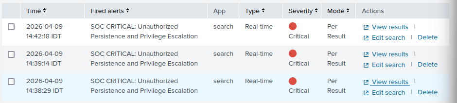

Phase-03-Detection-Engineering/README.md
# Phase 3: Detection Engineering and SIEM Architecture

## 1. Executive Summary
The objective of Phase 3 is to establish comprehensive network visibility and an active defense monitoring system over the hardened Active Directory environment. By deploying a centralized Splunk Enterprise SIEM architecture, the goal is to aggregate, parse, and analyze security telemetry across all domain assets to enable real-time threat detection for advanced attack tactics.

## 2. Network and Asset Scope
The monitoring environment consists of four core infrastructure components:
* **SIEM Server:** A Kali Linux machine hosting Splunk Enterprise. This server is strategically placed on the INTERNET_SERVERS network with a dedicated static IP address to ensure uninterrupted log ingestion and strict network segregation.
* **Domain Controller:** Windows Server 2022 handling Active Directory and Local Administrator Password Solution (LAPS) policies.
* **Client Endpoint:** Windows 11 workstation representing a standard corporate user.
* **Network Gateway:** pfSense firewall managing routing and network traffic.

---

## 3. Telemetry and Data Ingestion Pipeline

**Why we did this:**
To ensure total visibility across heterogeneous operating systems and network appliances, a multi-protocol ingestion pipeline was engineered. This establishes the necessary data foundation before any detection logic can be applied.



**What we did and how:**
* **Windows Environment via Universal Forwarders:** Lightweight Splunk Universal Forwarders were deployed to the Windows Server and Windows 11 endpoints. The local `inputs.conf` and `outputs.conf` files were manually configured to establish encrypted Splunk-to-Splunk TCP sockets on port 9997. The forwarders are strictly configured to capture critical Security, System, and Application event channels.
* **Network Appliance via Syslog:** The FreeBSD-based pfSense gateway is configured to forward native remote Syslog telemetry over UDP port 514. This captures firewall blocks, DHCP leases, and routing events. A dedicated syslog sourcetype was assigned at the Indexer level to ensure automated field extraction.
* **SIEM Self-Auditing:** Splunk is configured to actively monitor its own underlying Kali Linux host by reading local `/var/log/` files, tracking SSH authentications and system executions.

---

## 4. Threat Detection Use Cases

### Use Case 1: LAPS Break-Glass Account Activation (Interactive Logon)

**Why we did this:**
To establish a real-time detection mechanism for any interactive authentication attempts utilizing the obfuscated local administrator account (`emergencyIT`). This account is dynamically managed by LAPS and is architecturally reserved strictly for "break-glass" scenarios, such as a complete loss of domain trust. Standard operating procedures dictate this account should never experience an interactive logon under normal conditions.


**What we did and how:**
By specifically filtering for `Logon_Type=2` (Interactive/Physical keyboard logon), the rule is engineered to eliminate false positives originating from background services or network scans. Any successful authentication utilizing this account triggers an immediate Critical alert, indicating either an active emergency IT recovery process or a severe lateral movement compromise by an adversary.
* **Alert Configuration:** Real-time (ensuring zero-latency detection). Trigger Condition: Per-Result. Severity: Critical. Permissions: Shared in App.
* **Validation & Auditing:** To mathematically validate the detection pipeline, a physical authentication simulation was conducted on a domain-joined endpoint using the dynamic LAPS password retrieved directly from the Domain Controller's attributes. The Splunk Indexer successfully ingested the telemetry, parsed the event, and instantaneously triggered the Critical alert within the SOC dashboard.

```splunk
index="main" source="WinEventLog:Security" EventCode=4624 Account_Name="emergencyIT" Logon_Type=2
